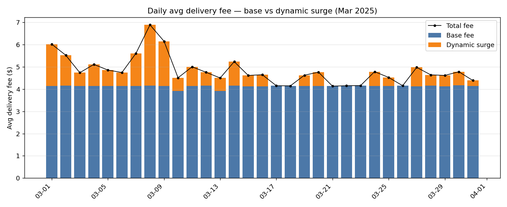
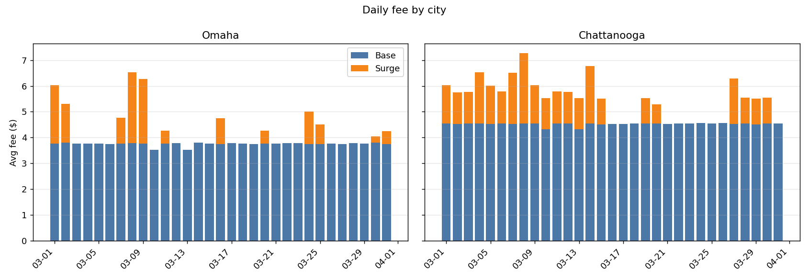
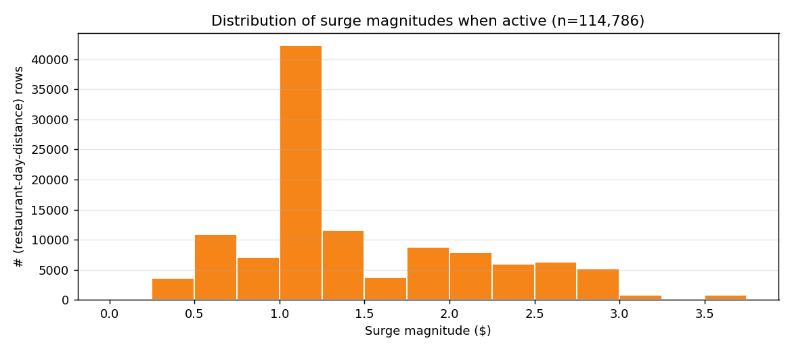
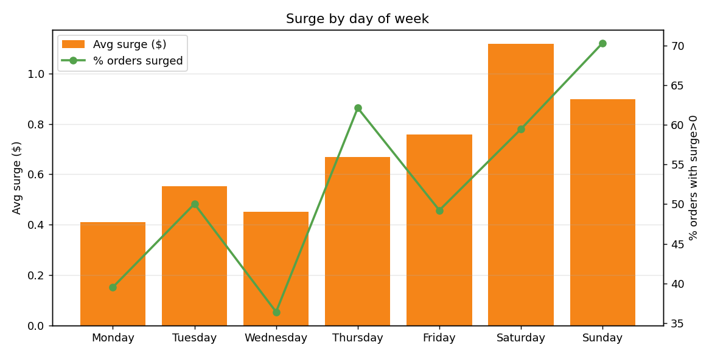
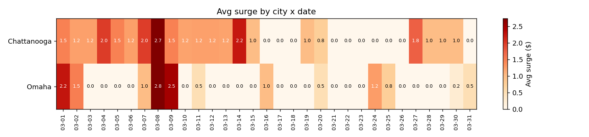
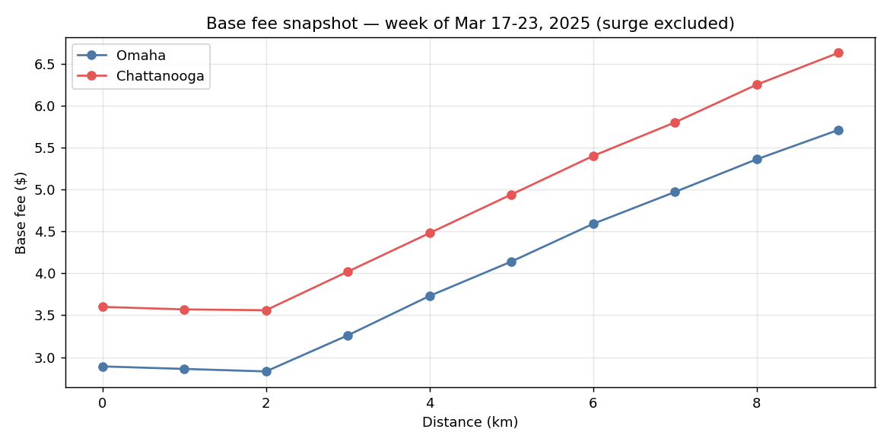
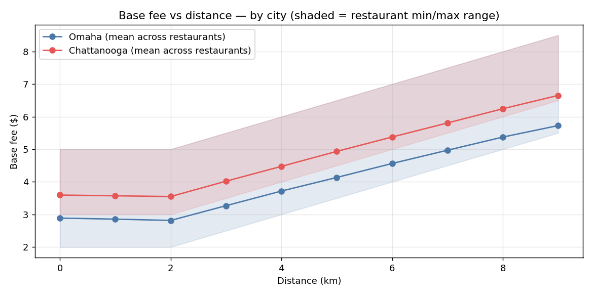

# LINE MAN Wongnai — Pricing Analyst Assessment

**Candidate:** Chotpisit Adunsehawat
**Role:** Data Analyst (Pricing), User Growth & Optimization
**Date:** 2026-06-11

---

## Quiz 1 — Market share & delivery-fee strategy

### 1.1 Strategies to achieve and sustain #1 market share in Thailand

LINE MAN's right to win is **local depth, not global scale**. The strategy should compound four advantages instead of competing on raw discounting:

1. **Win supply-side density first, then price the demand side.**
   In a two-sided market the operator with the highest rider density at any given lat/long has the lowest marginal delivery cost and the lowest customer ETA. Concentrate rider supply growth in the top 20–30 demand polygons (Bangkok CBD, Chiang Mai old town, Phuket beachfronts, university districts) so that LINE MAN's *cost-to-deliver* curve sits permanently below Grab/foodpanda's in those polygons. Once that gap exists, every pricing or coupon dollar buys more bookings than the competitor's same dollar.

2. **Use the LINE ecosystem as a near-zero-CAC growth channel.**
   LINE Messenger has ~50M MAU in Thailand. Treat LINE OA broadcasts, Rich Menu, Mini-app entries, and LINE Pay as the cheapest funnel any competitor can match — particularly for upper-funnel reactivation (dormant 30/60/90-day users) where push notifications are saturated for competitors.

3. **Merchant lock-in through Wongnai content + POS + ads.**
   Wongnai reviews are the de-facto restaurant discovery layer in Thailand. Bundling discovery (Wongnai), ordering (LINE MAN), payment (LINE Pay/Rabbit LINE Pay), POS, and merchant-funded ads (sponsored listings, in-app coupons) into a single contract makes the merchant economically irrational to dual-platform once the share crosses ~40%.

4. **Hyper-local assortment and Thai-only verticals.**
   Street-food, "rod-khen" (cart) merchants, small Muslim/Halal districts, fresh-market grocery — verticals where global players struggle with onboarding and tax. Each new vertical broadens reasons-to-open without cannibalising restaurant GMV.

5. **Defend with dynamic, structurally lower fees, not blanket promos.**
   Subsidies are a tax on growth; structural unit economics are an asset. The pricing engine should let LINE MAN run *lower headline fees* in high-density polygons while charging *higher* fees where the competitor is also forced to surge — converting density advantage into a permanently lower price perception without permanent margin loss.

### 1.2 Delivery-fee levers I would prioritise to support #1 share

Listed in priority order, with the rationale for each:

| # | Lever | What it does | Why prioritise |
|---|---|---|---|
| 1 | **Geo-tiered base fee** | Different base + per-km schedule per H3/polygon, driven by rider density and competitor price | Highest-leverage lever. Lets us be cheapest where it matters most for share, and price-elastic-rich users where it doesn't hurt growth. |
| 2 | **Dynamic surge with explicit caps** | Time-of-day / weather / event surge with a hard ceiling and a visible "Why am I paying more?" reason code | Protects rider supply at peak (Fri/Sat dinner, rainy hours) without the PR risk of uncapped surge. |
| 3 | **Distance-banded fees with a flat zone** | Flat fee for the first 1–3 km, then per-km step | Matches Thai consumer mental model ("near = cheap"), reduces price shock on short orders which are the highest-frequency basket. |
| 4 | **Subscription / LINE MAN PRO free-delivery cap** | Monthly fee → free delivery under X km | Converts heavy users into a defended cohort; competitors can't easily match without bleeding margin. |
| 5 | **Merchant-funded delivery promo** | "Free delivery sponsored by Restaurant" tagged in UI | Shifts cost of acquisition from platform to merchant; merchant pays because elasticity is high and conversion lift > commission lost. |
| 6 | **Small-basket fee / minimum order** | Fee floor when basket < X THB | Protects rider economics and AOV without raising headline price. |
| 7 | **Personalised fee discount as a CRM tool** | Targeted free-delivery vouchers to churn-risk users only | Cheaper than broad promos; measured against churn-prevented, not GMV. |

The mental model: **levers 1–3 set the structure, 4–6 monetise the structure, 7 is the retention safety net.** I would *not* lead with a "free delivery everywhere" subsidy war — that destroys the unit economics needed to fund levers 1 and 4.

---

## Quiz 2 — Designing and evaluating a delivery fee

### 2.1 Factors I would consider when designing the delivery fee for a single restaurant

I would split factors into four groups: **cost-driven, demand-driven, supply-driven, strategy-driven.**

**Cost-driven (the floor)**
- Rider payout per trip in that area (distance × per-km rate + base) — fee cannot price below this without subsidy.
- Expected delivery distance distribution (haversine restaurant → typical drop-off).
- Expected delivery time / handling time at the restaurant (long prep → rider idle cost).
- Payment processing and platform infra cost per order (small but real).

**Demand-driven**
- Restaurant's price tier and AOV (THB 80 noodle shop vs THB 800 sushi — same fee is regressive on the first, invisible on the second).
- Historical demand elasticity to delivery fee in that polygon (how much do conversions drop per +THB 5 fee?).
- Customer LTV segment ordering from that restaurant (heavy LINE MAN users tolerate less fee variance).
- Substitute density — if there are 10 noodle shops within 1 km, fee elasticity is much higher.

**Supply-driven**
- Real-time rider availability in the restaurant's polygon (sparse riders → surge to clear queue).
- Time-of-day demand vs supply (Fri 7pm vs Tue 3pm).
- Weather (rain reduces rider supply ~30%, the standard surge trigger).
- Restaurant prep-time reliability — frequently-slow restaurants tie up riders and need to internalise that cost.

**Strategy-driven**
- Restaurant's strategic value: new vertical, exclusive partner, ad-spender — may justify lower fees.
- Competitor delivery fee from the same restaurant (or nearest substitute) — share defense.
- Promo budget allocated to that restaurant / category — fee may be partially merchant-funded.

**The pricing formula** I would propose (transparent to internal stakeholders, hidden from user):

```
fee = max(
  rider_payout(distance, area),               // hard floor — never lose money per trip
  base_fee(area_tier, restaurant_tier)        // strategic base
  + per_km * max(0, distance - flat_zone)     // distance step
  + surge(area, time, weather)                // dynamic
  - personal_discount(user_segment, campaign) // retention
)
```

The dataset in Quiz 3 is consistent with exactly this structure: **flat zone (km 0–2), $0.50/km step from km 3, additive surge on top.**

### 2.2 How delivery fee influences the user journey vs. coupons / menu promos / cashback

Delivery fee shows up **at a different moment** in the funnel and triggers a different psychological response than the other conversion tools. The differences matter because they change which lever you reach for in which situation.

| Tool | Where it shows in the journey | Psychological frame | Strongest use case | Weakness |
|---|---|---|---|---|
| **Delivery fee** | Visible on restaurant card, recomputed at checkout | "Friction tax" — pure subtractive | Browsing-stage conversion, ranking lift, polygon-level economics | Permanent perception risk; users anchor on the lowest fee they've ever seen |
| **Coupon** | Applied at cart/checkout, requires a code or auto-apply | "Reward" — additive feel | Acquisition (first-order), reactivation, churn save | Trains users to wait for coupons; high broadcast cost |
| **Menu promo / restaurant discount** | Shown on the dish itself | "Deal hunting" — discovery driver | Merchant co-funded, AOV uplift, off-peak demand | Doesn't help if the *delivery fee* is the blocker |
| **Cashback** | Post-order, applied to next order or wallet | "Loyalty" — delayed gratification | Frequency, switching cost, ecosystem lock-in (LINE Pay) | Lagging behaviour change; weaker for first-time users |

**Three asymmetries that matter for pricing decisions:**

1. **Conversion stage.** Delivery fee is the *only* lever that bites in the discovery stage — it appears on the restaurant card and changes the click-through. Coupons and cashback only act after the user has already chosen a restaurant. If our problem is "users open the app but don't pick a restaurant," delivery fee is the right lever; if our problem is "they pick but abandon at checkout," coupons are.

2. **Funding source flexibility.** Delivery fee is platform-funded by default; the other three can be merchant-, brand-, or partner-funded. So menu promos / cashback are cheaper margin tools, while delivery fee changes hit platform P&L directly.

3. **Behavioural memory.** Delivery fee is *perceived as a price* — users anchor on the lowest they have ever paid. Coupons and cashback are perceived as *gifts* and are forgotten when withdrawn. This means delivery fees should be moved with more strategic intent (and fewer reversals) than promo levers.

**Practical implication for our team:** delivery fee = structural / strategic lever; coupon + cashback = tactical / cohort levers; menu promo = merchant-leverage lever. They are complements, not substitutes.

### 2.3 Metrics to evaluate delivery fee performance, and how to judge strategy effectiveness

I would split metrics into **four layers — input, behavioural, business, ecosystem — and watch them as a hierarchy.**

**Layer 1 — Input / health (sanity checks)**
- Avg delivery fee (overall, by city, by polygon, by distance band)
- Surge frequency (% of orders with surge > 0) and surge intensity (avg surge | active)
- Coverage: % of order-attempts where a fee was successfully quoted
- Rider payout per order vs. fee charged (subsidy %)

**Layer 2 — Behavioural (causal-of-business)**
- **Search → checkout conversion rate** by fee bucket — the most direct elasticity signal
- **Cart abandonment rate**, especially at the moment delivery fee is revealed
- Avg basket distance (km) — moves when fee structure changes user choice
- Order frequency per active user (weekly cohorts)
- Substitution rate: when a user sees high fee, do they switch restaurant, switch time, or churn the session?

**Layer 3 — Business outcome**
- GMV per session / per active user
- Contribution margin per order = (commission + fee – rider payout – subsidies)
- Take-rate (% of GMV captured)
- New-user activation: first-order conversion from app install
- Retention: D7, D30, D90 of cohorts exposed to a new fee structure
- Rider earnings per online hour (the supply-side fairness metric)

**Layer 4 — Ecosystem / strategic**
- Market share by polygon (the ultimate scoreboard for the #1 goal)
- Merchant churn / dual-platform rate
- NPS / fee complaint volume (CS tickets tagged "delivery fee too high")

**How I would judge whether a strategy is "effective":**

A pricing strategy isn't effective just because GMV went up — that can be brute-forced with subsidy. I would look for **all four** of these signals together over a stable measurement window (4+ weeks, ideally A/B at polygon or user level):

1. **Marginal economics improved or held flat** — contribution margin per order is stable or up.
2. **Behaviour responded as predicted** — the elasticity assumption used in the design held in the data.
3. **No leakage into other levers** — we didn't just shift coupon spend into fee discount.
4. **No ecosystem damage** — rider earnings, merchant satisfaction, CS complaint rate stayed in range.

If 3 of 4 hold, iterate. If only 1–2 hold, the strategy is locally winning but structurally fragile — roll back or redesign before scaling.

---

## Quiz 3 — Delivery fee structure analysis

### Data overview

- **Period:** 2025-03-01 → 2025-03-31 (31 days, 217,222 rows)
- **Cities:** Omaha (513 restaurants), Chattanooga (487 restaurants); each restaurant belongs to a single city.
- **Distance:** integer km 0–9 (not every (restaurant, day, km) combination is observed; ~7 distance points sampled per restaurant-day)
- **Delivery fee:** $2.00 – $12.00, mean $4.84

### Methodology — decomposing fee into base and surge

I model the fee as:

> **fee(rid, date, km) = base(rid, km) + surge(rid, date)**

with two assumptions: (i) base depends only on restaurant and distance, (ii) surge is a single per-day, per-restaurant additive offset.

I fit the two factors with two-way alternating least squares (20 iterations) on the full 217k rows, then anchored the surge so that each restaurant's minimum observed surge is set to $0 (assumes every restaurant has at least one zero-surge day in the month).

**Fit quality:** residual std = 1.7×10⁻¹², **R² = 1.000**. The fee is exactly additive — no multiplicative interaction between base and surge. This validates the assumption that the two components can be cleanly isolated.

**Headline split:**
- Mean total fee: **$4.84**
- Mean base fee: **$4.13 (85.4%)**
- Mean dynamic surge: **$0.71 (14.6%)**
- Share of orders with any surge: **52.8%**
- Mean surge *when active*: **$1.34** (median $1.00, p90 $2.50, max $3.50)

---

### 3.1 Dynamic surge

#### 3.1.1 Isolating surge from base

The chart below shows the daily average fee decomposed. Blue = base, orange = surge. The black line is the realised total fee.



**Reading the chart:** the **blue bar is essentially flat across the month at ~$4.13** — the base fee is stable. **All visible day-to-day variation in the total fee comes from the orange surge layer.** This is consistent with the additive model: any movement in the headline fee that isn't a base-schedule change is, by construction, surge.

Surge by city:



Chattanooga has higher base ($4.53 vs $3.76) and higher surge frequency (67% vs 39% of orders), driving its higher headline fee ($5.47 vs $4.24).

#### 3.1.2 Surge behaviour — key stats & patterns

**Quantitative summary**

| Metric | Value |
|---|---|
| % orders with surge > 0 | 52.8% |
| Mean surge (all orders) | $0.71 |
| Mean surge (when active) | $1.34 |
| Median surge (when active) | $1.00 |
| Max surge | $3.50 |
| Surge granularity | discrete $0.25 increments |

**Surge magnitude distribution (when active)**

| Surge ($) | % of surged rows |
|---|---|
| 0.25 | 3.2% |
| 0.50 | 9.5% |
| 0.75 | 6.1% |
| **1.00** | **36.8%** ← modal |
| 1.25 | 10.0% |
| 1.50 | 3.2% |
| 1.75 | 7.6% |
| 2.00 | 6.8% |
| 2.25 | 5.2% |
| 2.50 | 5.5% |
| 2.75 | 4.5% |
| 3.00 | 0.7% |
| 3.50 | 0.7% |



**Notable patterns**

1. **Surge is discrete, not continuous.** All observed surge values fall on a $0.25 grid, with the modal value $1.00 (37% of surged rows). This suggests the engine quantises surge into pre-defined steps rather than computing a free-floating multiplier.

2. **Weekend > weekday.** Average surge is highest on Saturday ($1.12) and Sunday ($0.90), lowest on Monday ($0.41) and Wednesday ($0.45). Sunday also has the highest surge-frequency (70% of orders). This is exactly the food-delivery demand pattern you would expect.

   

   | Day | Avg surge ($) | % orders surged |
   |---|---|---|
   | Mon | 0.41 | 39.5% |
   | Tue | 0.55 | 50.0% |
   | Wed | 0.45 | 36.4% |
   | Thu | 0.67 | 62.1% |
   | Fri | 0.76 | 49.2% |
   | **Sat** | **1.12** | **59.5%** |
   | **Sun** | **0.90** | **70.3%** |

3. **Clear "zero-surge" days.** Six days in the month had zero surge across both cities: **Mar 17, 18, 21, 22, 23, 26**. These are exactly the calm windows that let us cleanly estimate the base fee structure.

4. **"Full activation" days.** Eight days had **every order surged** (surge>0 for 100% of rows): Mar 1, 2, 7, 8, 9, 11, 20, 30 — these are the system's high-demand days. The peak day was **Mar 8 (Saturday) with avg surge $2.74** — almost 2× the typical active-surge level and the highest of the month.

5. **Surge is restaurant-day specific, not city-wide.** On most "partial activation" days the surge frequency is ~48–50%, meaning roughly half of restaurants are surging while half are not. This is consistent with a polygon- or zone-level surge engine, not a city-wide flag.

   

---

### 3.2 Standard base fee

#### 3.2.1 Movement of the standard base fee over time

**The base fee does not move over time.** Within each (restaurant, distance) pair, the inferred base is perfectly constant across all 31 days (std = 0). The only day-to-day variation in the blue bars of the decomposition chart is a small mix-shift effect — different subsets of restaurants are observed on different days, so the *city-mean* base wobbles by ±$0.25 depending on which 6,000–7,000 restaurant-distance rows happened to be sampled that day, not because any restaurant changed its schedule.

**Daily average base fee (overall):** $3.91 – $4.17, range = $0.25 (entirely sampling noise).

**Conclusion:** The base fee is a static schedule across the observed month. All temporal variation in headline delivery fee is attributable to the dynamic surge layer.

#### 3.2.2 One-week snapshot of the base fee structure

**Selected week: Mon 2025-03-17 → Sun 2025-03-23** (chosen because 5 of the 7 days had zero surge, and the surge on Mar 19/20 affects only a known subset of restaurant-days, so the base layer is the dominant signal).

**Snapshot 1 — base fee curve by city × distance (surge fully excluded)**

| City | km 0 | km 1 | km 2 | km 3 | km 4 | km 5 | km 6 | km 7 | km 8 | km 9 |
|---|---|---|---|---|---|---|---|---|---|---|
| Omaha (mean) | 2.89 | 2.86 | 2.83 | 3.26 | 3.73 | 4.14 | 4.59 | 4.97 | 5.36 | 5.71 |
| Omaha (median) | 2.00 | 2.00 | 2.00 | 2.50 | 3.00 | 3.50 | 4.00 | 4.50 | 5.00 | 5.50 |
| Chattanooga (mean) | 3.60 | 3.57 | 3.56 | 4.02 | 4.48 | 4.94 | 5.40 | 5.80 | 6.25 | 6.63 |
| Chattanooga (median) | 3.00 | 3.00 | 3.00 | 3.50 | 4.00 | 4.50 | 5.00 | 5.50 | 6.00 | 6.50 |



**Snapshot 2 — the underlying schedule, which is universal across all 1,000 restaurants**

Although the *mean* base curve looks slightly non-linear (the means are pulled up by a "premium" archetype), every individual restaurant follows the same shape:

> **Flat zone for km 0–2, then +$0.50 per km from km 3 onwards.**

Only the *starting point* (the flat-zone fee) differs across restaurants. Three distinct archetypes account for all 1,000 restaurants:

| Archetype | km 0–2 (flat) | km 3 | km 4 | km 5 | km 6 | km 7 | km 8 | km 9 | Cities | # restaurants |
|---|---|---|---|---|---|---|---|---|---|---|
| **Standard — Omaha** | 2.00 | 2.50 | 3.00 | 3.50 | 4.00 | 4.50 | 5.00 | 5.50 | Omaha only | 361 (70% of Omaha) |
| **Standard — Chattanooga** | 3.00 | 3.50 | 4.00 | 4.50 | 5.00 | 5.50 | 6.00 | 6.50 | Chattanooga only | 342 (70% of Chattanooga) |
| **Premium** | 5.00 | 5.50 | 6.00 | 6.50 | 7.00 | 7.50 | 8.00 | 8.50 | Both | 152 Omaha + 145 Chattanooga ≈ 30% in each city |



**What this snapshot tells us about the base-fee schedule**

1. **The fee is piecewise linear with a 3 km flat zone.** Customers ordering within 2 km pay the same base regardless of distance — a deliberate consumer-friendly design for short-haul orders, which are typically the highest-frequency basket.

2. **The marginal per-km cost is $0.50, identical across both cities and all archetypes.** This is the per-km rider payout pass-through.

3. **The base-fee differentiation between cities and archetypes is in the *intercept*, not the slope.** Chattanooga's standard intercept is $1.00 higher than Omaha's — likely reflecting either higher rider payout floors, lower competitive intensity, or both. The premium archetype's intercept is $2 above Chattanooga standard / $3 above Omaha standard — likely a restaurant-tier or restaurant-distance-bucket adjustment for restaurants where customers are less fee-elastic.

4. **No restaurant has a "broken" or unusual base curve.** All 1,000 restaurants conform to one of the three archetypes. This means the base fee is set by **rule (city + restaurant-tier)**, not negotiated per restaurant — which is operationally healthy: it scales, it's auditable, and it's easy to change a whole tier at once.

---

## Appendix — files produced

- **`analysis.ipynb`** — fully executed Jupyter notebook with the end-to-end analysis (this is the reproducible source-of-truth for every number in §3)
- `analysis.py` — same logic as a standalone script
- `decomposed.parquet` — full dataset with the fitted `base` and `surge` columns
- `out_daily_overall.csv`, `out_daily_by_city.csv` — daily fee/base/surge averages
- `out_base_curve_by_city.csv` — mean/median/min/max base by city × km
- `out_week_base_snapshot.csv` — Mar 17–23 base snapshot
- `charts/01..07_*.png` — all charts referenced above
